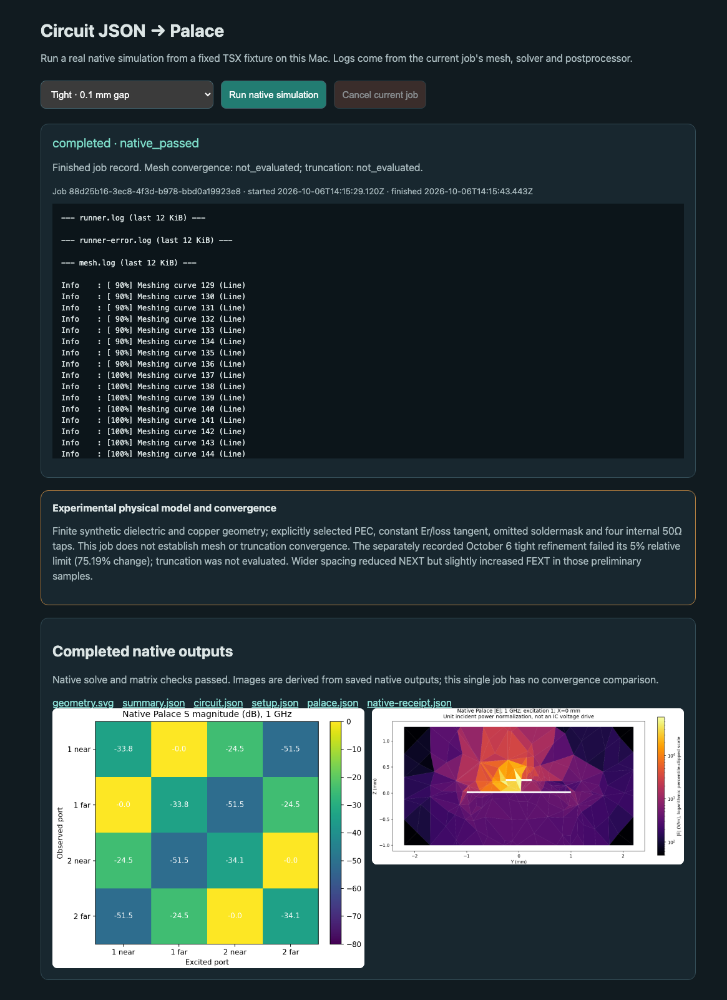
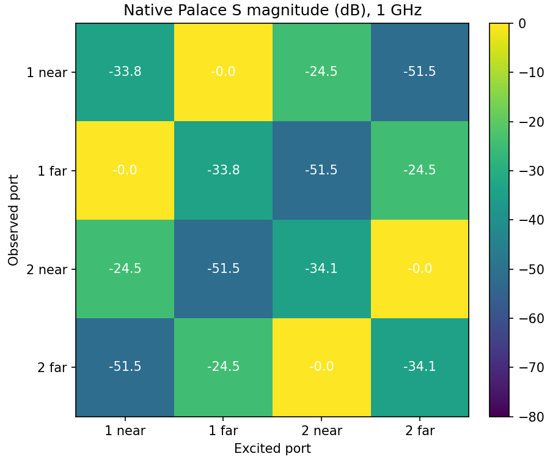
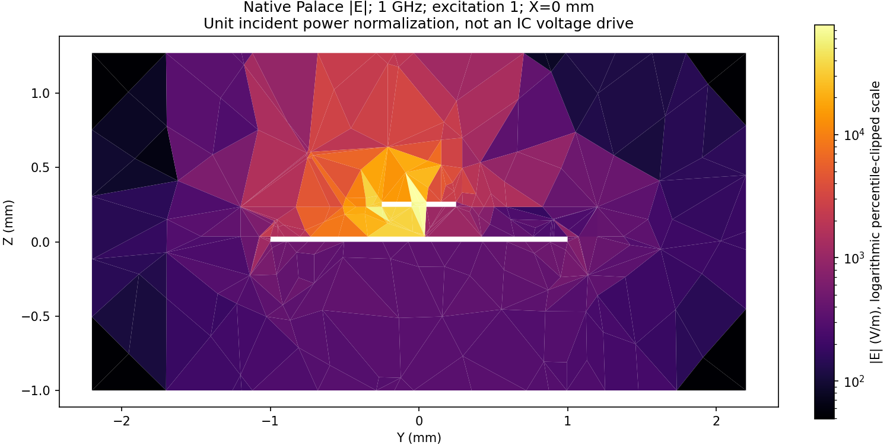

# circuit-json-crosstalk-simulation

An experimental Bun API for rendered Circuit JSON → a finite Palace EM model → native S parameters and electric-field images. The included TSX fixture has two 4 mm parallel routes, actual endpoint pads, an actual bottom copper pour, and an explicitly assumed synthetic stackup. A stackup alone cannot yield meaningful signal-integrity results.

```tsx
import { analyzeCrosstalk } from "./lib"
import { renderCoupledRoutes } from "./examples/coupled-routes"
import { exampleSetup } from "./examples/setup"

const circuitJson = await renderCoupledRoutes(0.1)
const result = await analyzeCrosstalk(circuitJson, {
  output_directory: "work/tight-export", // Must not already exist.
  setup: exampleSetup(circuitJson),
  mode: "export",
})
console.log(result) // exported; native_status: never_run
```

Run `bun install --frozen-lockfile`, `bun test`, and `bun run typecheck`. `bun run example --output work/tight --gap 0.1` renders real TSX and exports it without modifying the rendered geometry. For existing files, use `bun run analyze --circuit circuit.json --setup setup.json --output work/run`. CI tests rendering, input rejection, units, deterministic export and Python syntax; **CI never runs Palace** and produces no simulated fields.

The renderer/schema dependencies are pinned PR builds: core `265b821`, props `9b7826e`, and circuit-json `8876d64` (stackup PR #871). These are reproducible experimental dependencies, pending stable package releases.

To watch an actual job, set `PALACE_BIN` and `PALACE_PYTHON` to the installed native runtimes and run `bun run serve`. Open **http://127.0.0.1:3217**, select a fixed fixture, and click **Run native simulation**. The page polls actual command logs while rendering, meshing, solving and postprocessing, then displays saved native images and links to the inputs, configuration, receipt and numerical summary. A finished job is labeled as a finished record; no progress percentages or recorded-log playback are presented as live. Its mesh/truncation status remains unevaluated, alongside the separate recorded failed refinement warning.

The server binds loopback only. Requests require allowed Host/Origin values and a per-session token; launch accepts only a single allowlisted fixture name. HTTP cannot supply paths, commands, source code, material overrides or arbitrary mesh settings. One job is reserved before rendering; concurrent Run requests get 409. Cancellation signals the owned Python supervisor and waits for subprocess/lock cleanup. Only regular, owned, allowlisted artifact files are served. Each UI job is limited to 90 seconds, one rank/thread, 6 GiB aggregate RSS and 256 MiB output; a session permits 16 jobs. Existing output directories are preserved. HTTP lifecycle tests use isolated mocks and do not constitute native evidence.

One actual Chrome Run click completed a native tight-fixture job on October 6. The browser observed live native logs, disabled Run while busy, and decoded both solver-derived images after completion. The native pipeline took 14.17 seconds, peaked at 548,962,304 bytes aggregate RSS and produced 32,711,821 bytes of output; all three stages exited zero. Its inputs match the recorded tight fixture, and its mesh/truncation status remains unevaluated. [Browser proof, raw S, source fingerprints and sanitized receipt](evidence/2026-10-06/web-ui) preserve that run. The proof notes the hosted process lifecycle and frontend polling delay; the screenshots are unmodified captures. Independent lightweight probes also verified real API-to-supervisor cancellation and child/owned-lock cleanup using disposable fake stages, without another native job.



Only the following physical scope is supported:

- One rectangular two-layer board with ordered top copper / dielectric / bottom copper.
- Exactly two coextensive, horizontal, straight, uniform top routes with distinct unbranched two-port source connectivity.
- One actual rectangular bottom `pcb_copper_pour`, selected by ID and reference net. The fixture's rendered pour is **5.6 × 2.0 mm**, smaller than its 6 × 2.4 mm board.
- Centered rectangular endpoint pads whose Y dimension matches route width and X dimension covers its round cap. Their exact copper union is rectangular. Bottom reference pads must lie within the actual pour and have source connectivity to its net.

Vias, through-pads, bends, tapers, holes, reference slots, stiffeners, rounded pads, additional copper and arbitrary multilayers fail explicitly. No whole-board reference plane is inferred from a copper stackup layer. IC/package bodies, drivers, receivers, PDN behavior and time-domain eyes are outside this model.

Circuit JSON owns board dimensions, XY geometry and stackup data in mm. `stackup_fill` can supply missing physical quantities with explicit `specified`/`assumed` provenance; it cannot replace known values. Original Circuit JSON is saved unchanged, and an assumed fill marks the effective stackup assumed. Missing Er, Er reference frequency, loss tangent (including explicit zero), its reference frequency, or thickness fails preflight. A material label such as `fr4` supplies no constants.

Analysis choices stay in [AnalysisSetup](lib/types.ts): selected traces/reference, conductor and dielectric models, nonmagnetic assumption, soldermask omission, four internal port taps and resistance, frequency samples, saved field frequency, air padding, mesh, boundaries, solver and check tolerances. The current conductor model is explicitly **PEC**: physical copper thickness is retained, supplied conductivity is preserved, and ohmic loss is omitted. Er and tanδ are explicitly held constant; physical reference frequencies remain separately visible. This is an approximation chosen by the testbench, not an inferred broadband material model.

| Circuit JSON / setup | Palace mapping |
| --- | --- |
| XY and thickness in mm | Gmsh coordinates in mm; `Model.L0 = 0.001` m |
| Relative `dielectric_constant` | `Domains.Materials.Permittivity` |
| Explicit constant `dielectric_loss_tangent` model | `Domains.Materials.LossTan` |
| Explicit PEC selection, finite foil geometry | Conductor interiors excluded; their actual surfaces get `Boundaries.PEC` |
| Frequency in Hz | Driven sample/save frequencies divided by 1e9 (GHz) |
| Four independent internal taps | Four integer excitation indices, each referenced to actual bottom copper; direction `-Z` |

These mappings follow the pinned official [Palace configuration schema](https://github.com/awslabs/palace/blob/0dc74cdf8c36c58b69b21c4a06e816048ec0b83f/scripts/schema/config-schema.json) and [lumped-port implementation](https://github.com/awslabs/palace/blob/0dc74cdf8c36c58b69b21c4a06e816048ec0b83f/palace/models/lumpedportoperator.cpp). Fields use unit incident power normalization, rather than an IC voltage drive. The internal taps leave explicit open end stubs. Air and substrate are finite; copper-free foil areas are air. The CAD guards retain source material/net identity, verify volumes, and check actual exported port triangles have two field neighbors and literal nodes shared with the intended PEC conductors.

For native execution, install [Palace from its official source](https://github.com/awslabs/palace) separately and create a Python environment using `python/requirements.txt`. No binary is bundled or downloaded by this package. Supply `PALACE_BIN` and `PALACE_PYTHON`, then run:

```sh
bun run example --output work/tight-native --gap 0.1 --native
bun run example --output work/wide-native --gap 0.8 --native
bun run example --output work/tight-refined --gap 0.1 --mesh-near 0.06 --native
"$PALACE_PYTHON" scripts/compare-native.py --tight work/tight-native \
  --wide work/wide-native --refined work/tight-refined --output work/comparison
```

The CLI uses one MPI rank/thread, a 300-second pipeline wall budget, 6 GiB aggregate RSS and 8 GiB output limit. Jobs acquire the owner-token lock `/tmp/dot-cloud-heavy.lock` (`PALACE_HEAVY_LOCK` can select the shared lock in another environment); an occupied lock is preserved. The API requires explicit bounded runtime values. Outputs include exact CJ/setup/model/config, CAD/mesh/contact audits, native command logs and receipts, raw complex S CSVs, native VTU fields, numerical checks, geometry SVG and solver-derived PNGs. `exported`, `runtime_unavailable`, `native_failed`, `native_passed`, `missing_data` and `unsupported` are distinct; solver and pipeline statuses are recorded separately in native receipts. Output directories are created exclusively.

Actual Mac smoke evidence is in [evidence/2026-10-06](evidence/2026-10-06). Palace was built from official commit `0dc74cdf8c36c58b69b21c4a06e816048ec0b83f` and reports `v0.18.1-dirty`; the private build changed bounded build parallelism and Accelerate linker flags only. Binary SHA-256: `6cb2750c6bebb97bc8aa24129618ef2933e81e47c424edb015abd5dd81847fff`. A separate official CPW regression passed beforehand; it establishes installation regression only.

| Completed 1 GHz native fixture | Field tetrahedra | Native NEXT S31 | Native FEXT S41 |
| --- | ---: | ---: | ---: |
| Tight 0.1 mm gap, near mesh 0.08 mm | 11,873 | −24.51 dB | −51.53 dB |
| Wide 0.8 mm gap, near mesh 0.08 mm | 12,054 | −45.29 dB | −50.94 dB |
| Tight 0.1 mm gap, near mesh 0.06 mm | 14,712 | −25.03 dB | −60.21 dB |

All three native solves exited zero, converged four independent excitations, and passed matrix passivity/reciprocity checks. The wider sample reduces NEXT but slightly increases FEXT. **The tight mesh comparison failed**: maximum selected relative complex coupling change was 75.19%, above the predeclared 5%; absolute all-S change 0.004618 passed the 0.005 limit. Truncation convergence was not evaluated. These results establish the TSX-to-native pipeline, not numerical SI qualification or a uniformly better layout. Full raw meshes/VTUs remain in the private run directories; committed evidence retains raw S, exact inputs, audits, field fingerprints/images and sanitized receipts. The original parser-failure receipt is preserved separately.




MIT adapter code. The source-identity/contact and field-reader methods were adapted from `tscircuit/simulate-return-current` work under the same MIT license. Palace is a separate Apache-2.0 runtime; its license and provenance are retained in its installation. No Circuit JSON schema or analyzer repository changes are included here.
