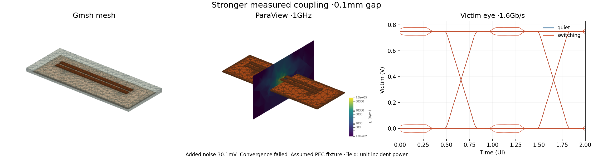
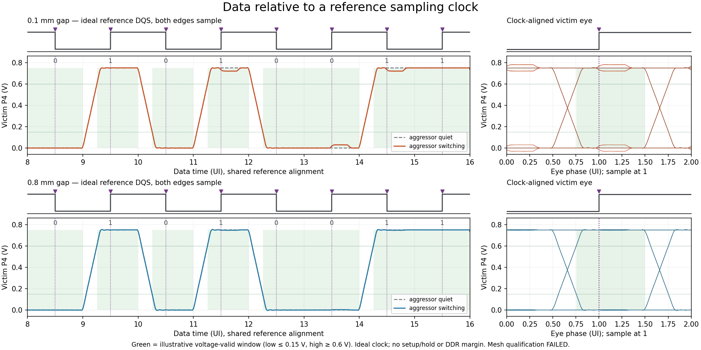

# circuit-json-crosstalk-simulation

TSX → Circuit JSON → **circuit-json-to-gmsh** → Palace → victim eyes.
Two comparable 4 mm routes use 0.1/0.8 mm edge gaps. Only spacing changes.

Install Bun, Python packages in `python/requirements.txt`, a CPU/SuperLU Palace build, and official ParaView with `pvpython`. Configure their paths, then run:

```sh
bun install --frozen-lockfile
export PALACE_PYTHON=/path/to/python
export PALACE_BIN=/path/to/palace
export PARAVIEW_PYTHON=/path/to/pvpython
bun run simulate
```

Open the printed `output/.../index.html`. It saves two separate three-panel images: actual Gmsh mesh, actual ParaView 3D field snapshot, and quiet/switching victim eyes. Cameras, field colors and eye axes match. Weaker/stronger labels follow measured added noise; a closed eye is never manufactured. Generated inputs, native meshes, raw complex channels, PVD/PVTU/VTU fields, logs and waveforms remain separately in ignored `output/`. Re-render saved data without a solve:

```sh
bun run render output/<run>
```

Saved native run (984 solves; ParaView 6.2.0):




The additional timing view uses the same saved victim voltages and fixed sampling phase. DQS is an **ideal reference**, with both edges sampling; no clock channel was simulated. Green marks explanatory 0.15/0.60 V voltage limits, not device thresholds or measured setup/hold margins.



New runs save this view automatically. Generate it once from an older saved run without a solver using `"$PALACE_PYTHON" python/timing.py output/<run>`; existing timing outputs are preserved.

| Gap | Added-noise peak | Quiet / switching opening | Complex-S mesh | Air / frequency sensitivity |
| --- | --- | --- | --- | --- |
| 0.1 mm | 30.1 mV | 747.9 / 714.1 mV | **Failed** | Passed / passed |
| 0.8 mm | 3.2 mV | 747.8 / 744.8 mV | **Failed** | Passed / passed |

These provisional numbers are not qualified SI results. Coarse→fine maximum all-S changes are 0.0370/0.0391 (limit 0.01), and selected coupling changes are 95.42%/5.57% (limit 5%, denominator floor 1e-4). Loaded-voltage checks pass, but neither full channel passes mesh qualification. The command therefore exits 1 after saving the images. [Exact inputs, raw channels, source/runtime fingerprints and checks](examples/results/measurements.json) accompany the snapshot; this run uses a local Palace build with banner `v0.18.1-dirty` and an included binary fingerprint.

Read-only [diagnosis](examples/results/diagnosis.json) confirms byte-identical physical CAD and ports within each layout. Tight-gap NEXT/FEXT maximum absolute changes are 0.02185/0.01376; relative changes are 6.66%/95.42%. Wide-gap values are 0.00195/0.00072 and 4.30%/5.57% (absolute and relative maxima can occur at different frequencies). The largest all-S failures are reflections at 10 GHz. The edge-distance minimum leaves a sparse dielectric-volume mesh; volume and port discretization errors are not yet isolated, and true residual accuracy is not independently bounded.

The displayed added-noise ranking holds across coarse/fine/domain and all four time/frequency/FIR sensitivities: tight 30.02–32.16 mV, wide 3.21–3.32 mV. The eye uses S43/S42; it does not use the worst S41 term. FEXT ranking at 250 MHz reverses with refinement, so this is not universal good/bad. Recompute the diagnosis without a native job (a new output filename preserves older reports):

```sh
"$PALACE_PYTHON" python/diagnose.py output/<run> output/<run>/diagnosis-new.json
```

The refinement guard rejects a shorter transition to coarse size; existing runs used the same transition and their failures remain unchanged. Three controlled meshes per layout are prepared for 10 MHz, 250 MHz, 1 GHz, 8.75 GHz and 10 GHz: an unchanged-size volume-remesh control, central dielectric-volume refinement with every surface frozen, and aperture-interior refinement with all other surfaces/contact edges frozen. Physical CAD, terminals, materials, boundaries and solver settings match exactly. Median gap edge sizes decrease from 0.141/0.210 to 0.066/0.067 mm in the volume cases; aperture triangles increase from 46 to 212 in the port cases. [Preparation audit](examples/results/prepared-mesh-audit.json) records the actual controls and limitations. **Their native solves were never run**, so neither the absolute error nor FEXT instability is resolved by this preparation. Original qualification failures remain. Port refinement still remeshes adjacent volume; the wider volume case also has a low-quality tetrahedron under the frozen-interface constraint.

The actual [exporter](https://github.com/tscircuit/circuit-json-to-gmsh) is pinned to `9c7f34b7`. `parseCircuitJson`, `createGeometryModel`, `createMeshRequirements` and `exportGmsh({conformal:true})` create and validate the board. `python/adapter.py` imports that BREP and maps its native mesh/manifest/report ownership by bounds and volume. It adds only a padded air box and four lumped apertures, then remeshes the extended domain conformally. It checks preserved material volume, shared interfaces, exterior absorbing faces, port area and literal contact nodes. The exporter's board validation mesh uses the configured far-size target; the EM remesh uses the near/far/transition settings. No custom PCB geometry generator replaces the package.

Circuit JSON owns the actual copper and explicit stackup in mm. `simulate(circuitJson,{setup,output_directory})` supplies ports, mesh, boundaries and solver separately. Snake_case physical fields map explicitly to the exporter's fabrication stack; zero loss is supplied, avoiding its default. Missing Er/loss/thickness fails. The analysis explicitly selects constant Er and loss tangent over the solved band. The fixture is **assumed synthetic Er=4, zero loss at 1 GHz, finite copper thickness with explicit PEC**, omitted mask and nonmagnetic materials. Conductivity is retained but PEC omits ohmic loss. This is neither manufacturer material data nor an arbitrary-board exporter. The adapter currently requires two straight top routes with covered rectangular endpoint pads and one actual rectangular bottom reference pour; unsupported physical geometry fails.

Palace uses `L0=1e-3` for mm and GHz frequencies. Ports are 50 Ω internal taps at X=±1.6 mm; the outer copper stubs remain open. Four independent excitations cover 10 MHz plus 0.25–10 GHz; selected 1 GHz fields are saved for ParaView. Field normalization is unit incident power. The eye uses complex broadband data, matched 50 Ω source/load dividers, 0–1.5 V ideal 200 ps ramps and deterministic 1.6 Gb/s bits. Quiet holds the aggressor at 0 V on the same coupled channel. A real causal loaded FIR preserves phase; it is not an IC/IBIS model or a Palace transient solve.

Six native cases run sequentially: coarse/fine meshes and a larger air box per layout. Raw passivity/reciprocity, full complex-S mesh/domain changes, loaded voltage changes, frequency-grid/bandwidth/time-step/FIR-support sensitivities and zero-drive controls stay explicit. Failed convergence remains visible and gives a nonzero CLI status **after artifacts are saved**. Passing local sensitivities is not an error bound, BER, DDR compliance or routing qualification. IC/package/PDN, jitter and noise are absent. Current source/runtime compatibility and measured outcomes are recorded with the saved run.

One MPI rank/thread, 600 s/6 GiB/256 MiB per native case; owner-token `/tmp/dot-cloud-heavy.lock` serializes shared compute and preserves other owners. Native cancellation reaches the supervisor and its children. ParaView rendering is separately bounded. No automatic runtime installation, cached channel fallback or GitHub CI is included.

Checks: `bun test`, `bun run typecheck`, `bun run format:check`, and `python -m unittest discover -s python -p 'test_eyes.py'`. MIT code; the real geometry dependency is MIT. Palace and ParaView are separate external runtimes.

`readNativeNoiseOutputs(runDirectory, caseName)` reuses saved native summaries and the full-resolution `eyes.py` waveform CSV. New eye receipts hash the model, summary and waveform capture as well as the original raw channel and Circuit JSON; older runs must regenerate their eye report before importing. `nativeNoiseWaveforms(outputs, runId, observationName)` returns canonical `simulation_pcb_noise_waveform_json_v1` payloads for total, baseline and difference. These are raw artifacts; retain `outputs.qualification`, including its failed mesh gates, when analyzing or displaying them.

`exportNativeNoiseAssets(outputs, {run_id, observation_name, ports, createJsonAsset})` accepts the shared `simulate-pcb-noise` asset encoder as a callback, avoiding a runtime dependency between the packages. It exports the full ordered complex S network and those three waveform assets with `validation.state: "unvalidated"`; it never creates a completed Circuit JSON result or qualifies a native run. The four supplied ports must refer to actual PCB ports at the model's internal apertures (P1/P2 on the first trace, P3/P4 on the second), `reference_plane: "native_internal_aperture"`, and the actual reference pour. The archived fixture's endpoint ports are at ±2 mm, while its apertures are at ±1.6 mm: that mapping returns `unsupported` without exporting network assets. Do not append invented contacts to a saved solver input to bypass this check. The native sweep has no DC solve, so its network always declares DC unavailable; the eye FIR's topology-derived constraint remains separate.
